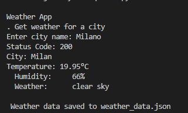

# CLI WEATHER APP

A clean and simple weather application that provides real-time weather updates. Built using [Python] and [OpenWeather API](https://openweathermap.org/).

---

## Features

- **Interactive CLI:** Prompts the user to input a city name directly in the terminal.
- **Real-time Data:** Displays the HTTP status code, city name, temperature, humidity, and a brief weather description.
- **Data Export:** Automatically saves the retrieved weather data into a local `weather_data.json`.

## Tech Stack

- **Language:** [Python]
- **API:** OpenWeather API

### Prerequisites

You will need a free API key from OpenWeather.

1. Go to [OpenWeather](https://openweathermap.org/) and create an account.
2. Navigate to your profile and generate a new API key.
3. Clone the repository.
4. Create a .env file and put you API KEY inside it (API_KEY=your_api_key_here).
